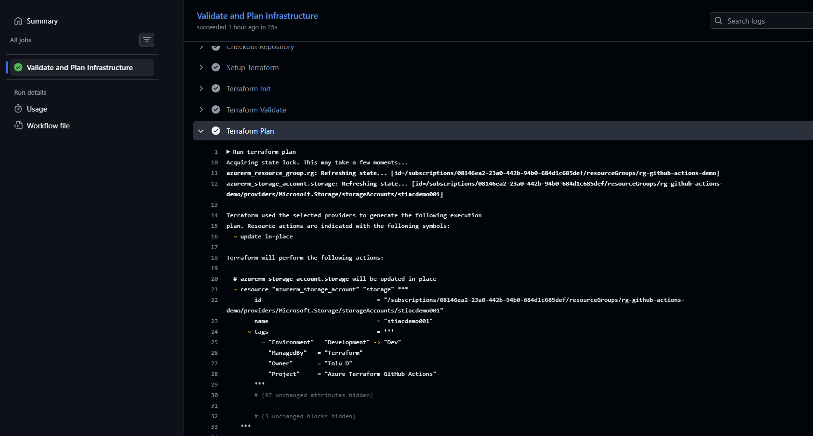
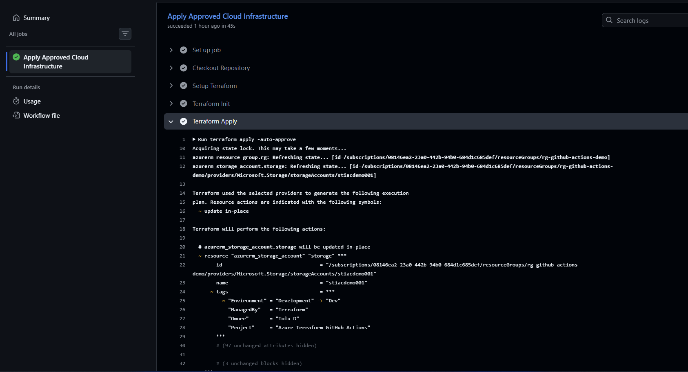
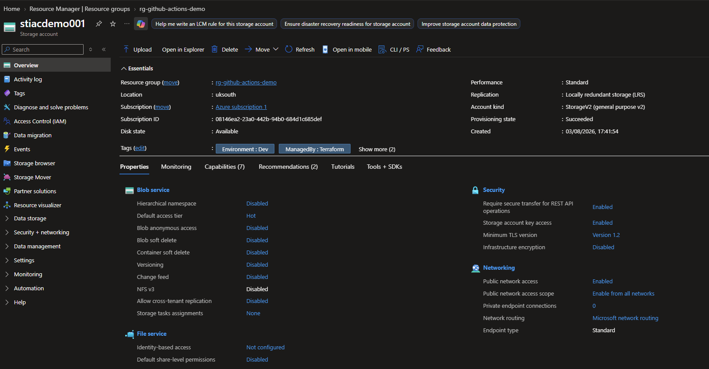
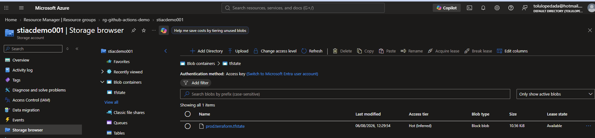

# Azure Terraform GitHub Actions CI/CD Pipeline

## Overview

This project demonstrates a production-style Infrastructure as Code (IaC) deployment pipeline using **Terraform**, **GitHub Actions**, and **Microsoft Azure**.

The solution provisions Azure infrastructure using reusable Terraform code and automates infrastructure validation, planning, and deployment through GitHub Actions. The Infrastructure state is securely stored in Azure Blob Storage using a remote backend to support collaboration, state locking, and disaster recovery.

Rather than deploying the infrastructure automatically after every code change, the pipeline is designed using a **two-stage deployment workflow**:

- **Terraform Plan** - Generates and reviews the execution plan.
- **Terraform Apply** - Manually triggered after reviewing the plan, providing a controlled deployment process.

This approach mirrors modern CI/CD practices commonly used within enterprise cloud environments.

---

# Solution Architecture

```text
                        +----------------------+
                        |     Engineer          |
                        +----------+-----------+
                                   |
                            Git Commit / Push
                                   |
                                   v
                    +------------------------------+
                    |      GitHub Repository        |
                    +--------------+---------------+
                                   |
                     Manual Workflow Dispatch
                                   |
                                   v
              +--------------------------------------+
              | GitHub Actions - Terraform Plan       |
              +--------------------------------------+
                       |
                       | Checkout Repo
                       | Terraform Init
                       | Terraform Validate
                       | Terraform Plan
                       |
                       v
                 Review Execution Plan
                       |
                 Manual Approval
                       |
                       v
              +--------------------------------------+
              | GitHub Actions - Terraform Apply      |
              +--------------------------------------+
                       |
                       | Checkout Repo
                       | Terraform Init
                       | Terraform Apply
                       |
                       v
                 Microsoft Azure
                       |
          +------------+-------------+
          |                          |
          v                          v
 Azure Resource Group        Azure Storage Account
                                     |
                                     v
                          Azure Blob Storage
                    (Remote Terraform State)
```

---

# Technologies Used

- Terraform
- GitHub Actions
- Microsoft Azure
- Azure Resource Manager (ARM)
- Azure Storage Account
- Azure Blob Storage
- Azure Service Principal
- Git
- GitHub
- YAML

---

# Key Features

- Infrastructure as Code (IaC)
- GitHub Actions CI/CD
- Two-stage deployment workflow
- Manual deployment approval
- Remote Terraform Backend
- Azure Blob Storage State Management
- Terraform State Locking
- Azure Service Principal Authentication
- GitHub Secrets
- Parameterised Terraform Variables
- Automated Validation
- Automated Planning

---

# Repository Structure

```text
azure-terraform-github-actions/

│
├── .github/
│   └── workflows/
│       ├── terraform-plan.yml
│       └── terraform-apply.yml
│
├── terraform/
│   ├── main.tf
│   ├── providers.tf
│   ├── variables.tf
│   ├── outputs.tf
│   ├── terraform.tfvars
│   └── .terraform.lock.hcl
│
├── website/
│   └── index.html
│
├── screenshots/
│   ├── github-plan-success.png
│   ├── github-apply-success.png
│   ├── azure-storage-account.png
│   ├── azure-blob-state.png
│   └── repository-structure.png
│
├── .gitignore
│
└── README.md
```

---

# Deployment Workflow

## Stage 1: Terraform Plan

The planning workflow performs the following tasks:

- Checks out the repository
- Installs Terraform
- Authenticates to Azure using a Service Principal
- Initializes Terraform
- Validates the Terraform configuration
- Generates an execution plan

No infrastructure changes are performed during this stage.

The generated execution plan is reviewed before any deployment proceeds.

---

## Stage 2: Terraform Apply

After reviewing the execution plan, the deployment workflow is manually triggered.

The workflow performs:

- Repository checkout
- Terraform initialization
- Authentication to Azure
- Infrastructure deployment using Terraform Apply

Separating planning from deployment provides additional operational control and reduces the risk of unintended infrastructure changes.

---

# Security

This project follows several cloud security best practices.

- Azure Service Principal authentication
- Least-Privilege access model
- GitHub Secrets for credential storage
- No credentials stored in source code
- Remote Terraform State
- Terraform State Locking
- Version-controlled Infrastructure as Code

---

# Remote Terraform State

Terraform state is stored remotely in Azure Blob Storage instead of storing locally on a workstation.

Benefits include:

- Centralised state management
- Team collaboration
- State locking
- Disaster recovery
- Redued risk of state corruption

---

# Infrastructure Provisioned

The current Terraform configuration provisions:

- Azure Resource Group
- Azure Storage Account
- Azure Blob Container
- Remote Terraform Backend

---

# Screenshots

## Terraform Plan Workflow



---

## Terraform Apply Workflow



---

## Azure Storage Account



---

## Azure Blob Storage Remote Backend



---

# Skills Demonstrated

This project demonstrates practical experience with:

- Infrastructure as Code (Terraform)
- Microsoft Azure
- GitHub Actions CI/CD
- Git Version Control
- YAML Workflow Development
- Azure Service Principals
- GitHub Secrets
- Remote Terraform State
- Terraform State Locking
- Azure Blob Storage
- Infrastructure Automation
- Cloud Security Best Practices

---

# Lessons Learned

During this project I gained practical hands-on experience with:

- Building Infrastructure as Code solutions using Terraform
- Designing GitHub Actions CI/CD workflows
- Implementing remote Terraform state management
- Migrating Terraform state from a local backend to Azure Blob Storage
- Authenticating GitHub Actions securely using Azure Service Principals
- Troubleshooting Terraform backend configuration
- Understanding infrastructure drift and state reconciliation
- Implementing controlled infrastructure deployment processes

---

# Future Enhancements

Potential future improvements include:

- Multi-environment deployments (Development, Test, Production)
- Terraform Modules for reusable infrastructure
- OpenID Connect (OIDC) authentication instead of client secrets
- Static website deployment to Azure Storage
- Automated security scanning
- Terraform formatting and linting within CI/CD
- Policy-as-Code integration

---

# Author

**Tolu Dada**

Cloud Infrastructure | Platform Engineering | Azure | Terraform | GitHub Actions | VMware | Windows Server | Linux

---

## License

This repository is provided for educational and portfolio purposes.
